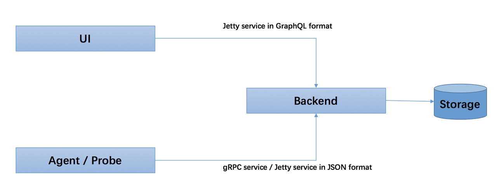
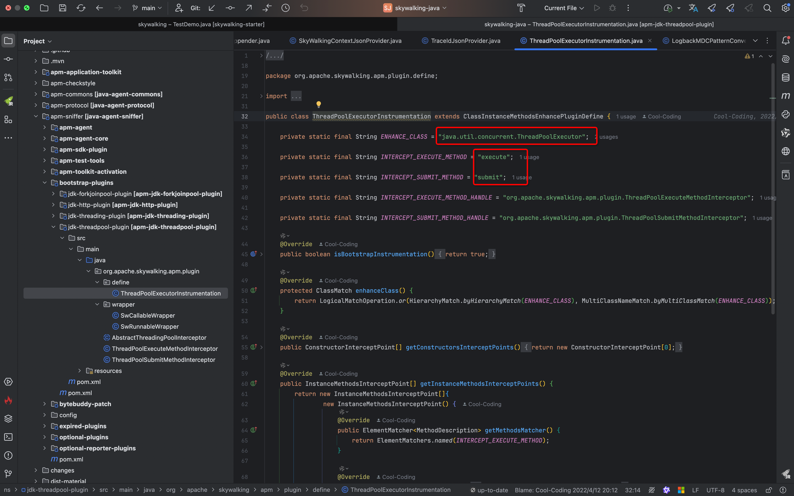
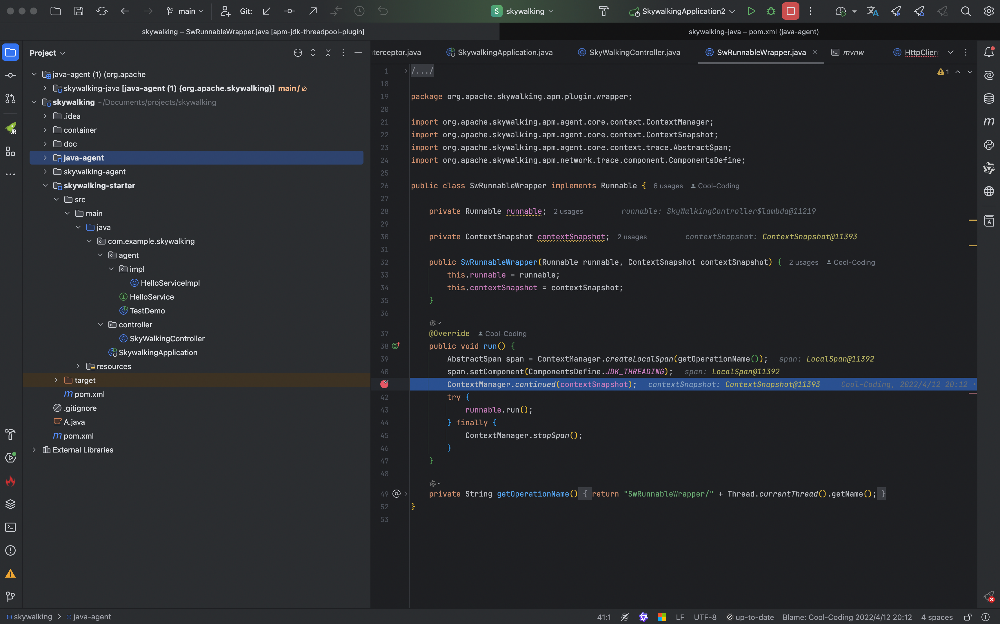
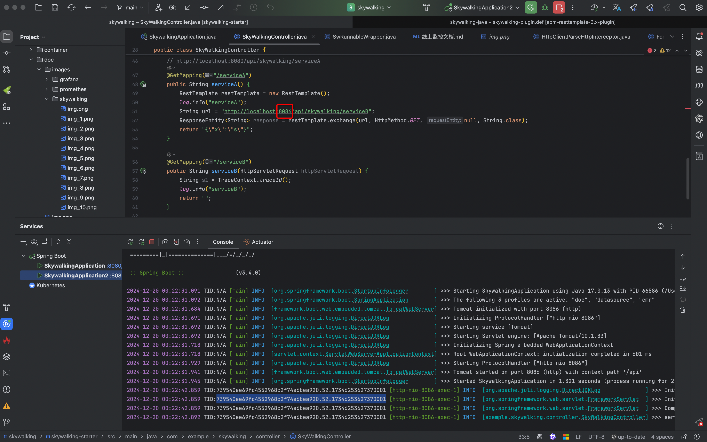
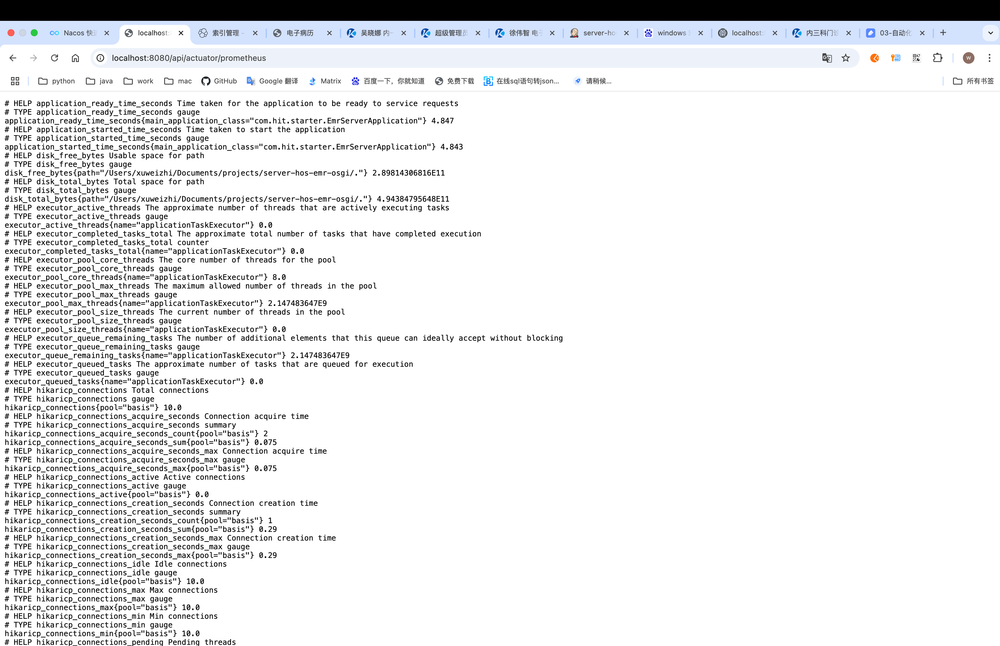

# 1. elk

## 1.1 elk 部署不在详细说明

docker-compose.yml

```yaml
version: "3"
services:
  elasticsearch:
    container_name: elasticsearch
    hostname: elasticsearch
    image: docker.elastic.co/elasticsearch/elasticsearch:${elasticsearch_version}
    restart: always
    ports:
      - 9200:9200
      - 9300:9300
    volumes:
      #      - ./elasticsearch/master/conf/elastic-search.yml:/usr/share/elasticsearch/config/elasticsearch.yml
      - ./elasticsearch/data:/usr/share/elasticsearch/data
      - ./elasticsearch/logs:/usr/share/elasticsearch/logs
      - ./elasticsearch/elastic-certificates.p12:/usr/share/elasticsearch/config/elastic-certificates.p12
      - ./elasticsearch/plugins:/usr/share/elasticsearch/plugins
    environment:
      - ES_JAVA_OPTS
      - "discovery.type=single-node"
  kibana:
    container_name: kibana
    hostname: kibana
    image: docker.elastic.co/kibana/kibana:${elasticsearch_version}
    restart: always
    ports:
      - 5601:5601
    volumes:
      - ./kibana/conf/kibana.yml:/usr/share/kibana/config/kibana.yml
    environment:
      - elasticsearch.hosts=http://elasticsearch:9200
    depends_on:
      - elasticsearch
  logstash:
    container_name: logstash
    hostname: logstash
    image: docker.elastic.co/logstash/logstash:${elasticsearch_version}
    restart: always
    volumes:
      - ./logstash/yml/logstash.yml:/usr/share/logstash/config/logstash.yml
      - ./logstash/conf/:/usr/share/logstash/pipeline/
    environment:
      - TZ=Asia/Shanghai
    depends_on:
      - elasticsearch
    ports:
      - 5044:5044
      - 5045:5045
  filebeat:
    container_name: filebeat
    hostname: filebeat
    image: docker.elastic.co/beats/filebeat:${elasticsearch_version}
    restart: always
    entrypoint: "filebeat -e -strict.perms=false"
    # 持久化挂载
    volumes:
      - ./filebeat/conf/filebeat.yml:/usr/share/filebeat/filebeat.yml
      # 映射到容器中[作为数据源]
      - /Users/xuweizhi/Documents/projects/spring-cloud/logs:/var/log/
      - ./filebeat/logs:/usr/share/filebeat/logs
      - ./filebeat/data:/usr/share/filebeat/data
    # 将指定容器连接到当前连接，可以设置别名，避免ip方式导致的容器重启动态改变的无法连接情况
```

配置文件注意点

- filebeat: /Users/xuweizhi/Documents/projects/spring-cloud/logs:/var/log/ 需要服务器或者本地应用日志路径
    - "/var/log/" 路径需要与filebeat.yml 中监听路径相同，否则监听文件将会失败
- logstash: conf 目录下默认为 filebeat 日志上传服务，根据具体场景选择 filebeat\logback 配置进行覆盖

### 1.1.1 设置 x-pack 密码

容器启动后进入 elasticsearch 容器初始化 xpack 密码

    docker exec -it elasticsearch /bin/bash

    # 随机生成密码
    ./bin/elasticsearch-setup-passwords auto
    
    # 生成指定指定密码
    ./bin/elasticsearch-setup-passwords interactive

### 1.2 logstash-logback 添加自定义字段

静态属性直接在 logback-spring.xml 配置文件中配置,比如 applicationName

```xml

<appender name="LOGSTASH" class="net.logstash.logback.appender.LogstashTcpSocketAppender">
    <param name="Encoding" value="UTF-8"/>
    <!-- logstash 地址 -->
    <destination>${logstashHost}</destination>
    <includeCallerData>true</includeCallerData>
    <keepAliveDuration>5 minutes</keepAliveDuration>
    <reconnectionDelay>5 second</reconnectionDelay>
    <encoder charset="UTF-8" class="net.logstash.logback.encoder.LogstashEncoder">
        <!-- 必须为 true 才会追加字段-->
        <includeContext>true</includeContext>
        <includeCallerData>true</includeCallerData>
        <timeZone>UTC</timeZone>
        <!--这个有错误-->
        <timestampPattern>[UNIX_TIMESTAMP_AS_STRING]</timestampPattern>
        <!-- logstash 自动追加字段 -->
        <customFields>
            {"appName":"${applicationName}"}
        </customFields>
    </encoder>
    <!-- 自定义字段 -->
    <contextMap>
        <entry key="environment" value="production"/>
        <entry key="application" value="${applicationName}"/>
    </contextMap>
</appender>
```

动态数据需要通过 MDC 设置属性,注入属性的方式多种多样，通过 filter 注入只是其中一种

```java
package com.hit.gateway.filter;

import com.hit.common.integrated.context.ApplicationTraceContext;
import com.hit.gateway.config.IpAddressConfig;
import jakarta.servlet.*;
import jakarta.servlet.http.HttpServletRequest;
import jakarta.servlet.http.HttpServletResponse;
import org.apache.commons.lang3.StringUtils;
import org.apache.skywalking.apm.toolkit.trace.TraceContext;
import org.slf4j.MDC;
import org.springframework.stereotype.Component;

import jakarta.annotation.Resource;

import java.io.IOException;
import java.util.UUID;

@Component
public class LogstashFilter implements Filter {

    @Resource
    private IpAddressConfig ipAddressConfig;

    @Override
    public void init(FilterConfig filterConfig) throws ServletException {
    }

    @Override
    public void doFilter(ServletRequest request, ServletResponse response, FilterChain chain)
            throws IOException, ServletException {


        try {
            // 如果外部接口传递有 tid,则直接使用外部传递过来的 tid 数据
            HttpServletRequest httpServletRequest = (HttpServletRequest) request;
            String tid = httpServletRequest.getHeader("tid");

            if (tid == null) {
                String skywalkingTraceId = TraceContext.traceId();
                ApplicationTraceContext.setTraceId(StringUtils.isBlank(skywalkingTraceId) ? UUID.randomUUID().toString() : skywalkingTraceId);
            }

            // MDC 中设置属性后，logstash 在上传时会主动读取并把属性添加到日志文件中
            MDC.put("tid", ApplicationTraceContext.getTraceId());
            MDC.put("host", ipAddressConfig.getServerIp());
            ((HttpServletResponse) response).setHeader("tid", ApplicationTraceContext.getTraceId());
            chain.doFilter(request, response);
        } finally {
            MDC.remove("tid");
            MDC.remove("host");
        }

    }

    @Override
    public void destroy() {
    }

}
```

tid 在多线程、远程调用、消息队列等中可能会丢失数据

- 多线程场景下: 使用 transmittable-thread-local 进行线程封装传递，每次执行是都会把当前线程本地变量传递给下一个线程，达到多个线程之间
  tid 保持一致。
- 远程调用场景下: 在远程调用的客户端和服务端都需要进行统一处理，把上游服务传递过来的 tid 设置当前线程中，这样在多服务多节点的情况下，各服务间的tid
  都是同一个。
- 定时任务: skywalking 不会生成 tid, 所以需要扩展 jobHandler 方法，在每次执行前需要生成一个唯一的 tid,执行日志中打印
  tid,便于查看日志排查问题。
- 消息队列: Mq 标准实现在发送消息队列前，可以对发送方法进行扩展，类似 http header 的设定，这样在消费时消费端可以知晓消息发送的上游日志。
- Spring 监听: 设置监听器线程池，与多线成场景一致。

这里以 Spring 监听器线程池的配置方式,重写 AsyncConfigurer#getAsyncExecutor 方法。

```java
package com.ideal.hos.emr.sib.config;

import com.alibaba.ttl.threadpool.TtlExecutors;
import lombok.extern.slf4j.Slf4j;
import org.springframework.aop.interceptor.AsyncUncaughtExceptionHandler;
import org.springframework.beans.factory.annotation.Value;
import org.springframework.context.annotation.Bean;
import org.springframework.context.annotation.Configuration;
import org.springframework.scheduling.annotation.AsyncConfigurer;
import org.springframework.scheduling.concurrent.ThreadPoolTaskExecutor;

import java.util.concurrent.Executor;
import java.util.concurrent.ThreadPoolExecutor;

/**
 * 异步线程池配置
 *
 * @author xuweizhi
 */
@Slf4j
@Configuration
public class AsyncThreadPoolConfig implements AsyncConfigurer {

    @Value("${spring.sync.corePoolSize:32}")
    private Integer corePoolSize;

    @Value("${spring.sync.maxPoolSize:32}")
    private Integer maxPoolSize;

    @Value("${spring.sync.keepAliveSeconds:200}")
    private Integer keepAliveSeconds;

    @Value("${spring.sync.queueCapacity:2048}")
    private Integer queueCapacity;


    @Bean(name = "asyncExecutor")
    public ThreadPoolTaskExecutor asyncThreadPoolTaskExecutor() {
        ThreadPoolTaskExecutor threadPoolTaskExecutor = new ThreadPoolTaskExecutor();
        // 核心线程数
        threadPoolTaskExecutor.setCorePoolSize(corePoolSize);
        // 最大线程数,只有在缓冲队列满了之后才会申请超过核心线程数的线程
        threadPoolTaskExecutor.setMaxPoolSize(maxPoolSize);
        // 缓存队列
        threadPoolTaskExecutor.setQueueCapacity(queueCapacity);
        // 线程空闲时间,当超过了核心线程出之外的线程在空闲时间到达之后会被销毁
        threadPoolTaskExecutor.setKeepAliveSeconds(keepAliveSeconds);
        // 异步方法内部线程名称
        threadPoolTaskExecutor.setThreadNamePrefix("async-");
        threadPoolTaskExecutor.setRejectedExecutionHandler(new ThreadPoolExecutor.CallerRunsPolicy());
        threadPoolTaskExecutor.initialize();

        return threadPoolTaskExecutor;
    }

    /**
     * 指定默认线程池，使用@Async注解时，不指定线程池名称，默认使用此线程池
     */
    @Override
    public Executor getAsyncExecutor() {
        log.info("初始化异步执行默认线程池");
        return TtlExecutors.getTtlExecutor(asyncThreadPoolTaskExecutor());
    }

    @Override
    public AsyncUncaughtExceptionHandler getAsyncUncaughtExceptionHandler() {
        return ((ex, method, params) -> log.error("线程池执行任务发送时出现异常：", ex));
    }
}
```

## 1.2 filebeat

logstash-logback-encoder 集成使用很方便，但是其内部采用多线成异步处理，如果在同一个 linux 系统中，部署了多个节点会对 cpu
造成极大浪费。

Filebeat 是一个轻量级的日志传输工具，主要用于收集和转发日志文件，Filebeat 轻量级且资源占用低，可以同时监听多个服务日志文件，并立即推送到
logstash 中，确保日志数据的实时性和准确性。

```yaml
filebeat.inputs:
  - type: log
    enabled: true
    paths:
      - /var/log/*.log
    multiline.pattern: '\d{4}-\d{2}-\d{2} \d{2}:\d{2}:\d{2}\.\d{3}'
    multiline.negate: true
    multiline.match: after
```

使用 filebeat 最难处理的是对日志文件词条拆分，对 grok 熟练度要求比较高:

```conf
filter {
        # grok
        # 匹配日志格式
        grok {
                match => { "message" => "%{TIMESTAMP_ISO8601:timeStamp}\s{0,10}%{LOGLEVEL:level}\s{0,10}\[%{USER:threadName}\]\s{0,10}%{NUMBER:pid}\s{0,10}\---\s{0,10}\[%{USER:appName}\]\s{0,10}\[TID:%{USERNAME:tid}\] \.{0,1}%{JAVACLASS:class}\s{0,40}:%{JAVALOGMESSAGE:msg}" }	#在这里引用
                # 自定义模式
                pattern_definitions => {
                    "CUSTOMER_DATA" => "\"[^\"]+\""
                }
        }

        # 删除无用字段
        mutate {
            enable_metric => "false"
            remove_field => ["file","agent","containerized","@version","event","message","@timestamp"]
            add_field => { "ip" => "%{[host][ip][0]}" }
            remove_field => ["host"]
        }
        # 时间格式化
        date {
            match => ["timeStamp", "yyyy-MM-dd HH:mm:ss.SSS"]
            target => "@timestamp"
            remove_field => "timeStamp"
        }
}
```

kiban 可以对 grok 日志样例和语句直接调试,其实就是考验大家正则表达式的功底:


内置的 grok
语句参考网站 https://help.aliyun.com/zh/sls/user-guide/grok-patterns?scm=20140722.184.2.173#section-608-5hv-y0b

使用方式

```yaml
%{常用模式:命名}
```  

例子

```yaml
2022-05-11 15:01:43.059

%{TIMESTAMP_ISO8601:logDate}
```

# 2. artahs 和 skywalking

为什么要将两者放在一起说呢?他们底层是实现原理都使用 java 的 agent 机制。

## 2.1 什么是 java agent 机制？

Java Agent 是 Java 1.5 版本之后引⼊的特性，其主要作⽤是在class被加载之前对其拦截，已插⼊我们的监听字节码

官方文档: https://docs.oracle.com/javase/8/docs/platform/jvmti/jvmti.html#whatIs

用通俗易懂的话来说就是，我们可以不改变原有项目的任何代码，对项目进行一些增强操作

**agent的加载时机**

Java的Agent加载时机分别有两处

- 加载时刻增强（JVM 启动时加载）
- 动态增强（JVM 运行时加载）

我们要如何进行编码来实现我们的增强逻辑呢？JVM提供了几个入口函数，是不是感觉很熟悉呢？与业务代码相同，开发过程总是会留一些口子便于业务数据或者核心逻辑。

JVM 启动时加载启动时的入口方法提供了两个,这两个函数的优先级是，如果没有方法一，则寻找方法二

```java
 // 方法一
public static void premain(String agentArgs, Instrumentation inst);

// 方法二
public static void premain(String agentArgs);
```

**动态增强（JVM 运行时加载）**

JVM 运行时加载也提供了两个入口方法

```java
// 方法一
public static void agentmain(String agentArgs, Instrumentation inst);

// 方法二
public static void agentmain(String agentArgs);
```

与上面JVM 启动时加载的加载机制一样。如果没有方法一，则寻找方法二

如果刚接触agent大家可能还是有点懵,没关系，下面我们先带大家写一个简单的demo来看看效果，这样就更容易理解

```java
public class HelloService {

    public String say() {
        System.out.println("===hello world====");
        return "hello world";
    }

    public String say2() {
        try {
            Thread.sleep(1000);
        } catch (InterruptedException e) {
            e.printStackTrace();
        }
        return "hello world";
    }
}

public class AgentExample {

    // -javaagent:/Users/xuweizhi/Documents/projects/summary/java/java-agent/byte-buddy/target/byte-buddy-1.0.0.jar
    public static void main(String[] args) {

        HelloService helloService = new HelloService();
        helloService.say();
        helloService.say2();
    }

}

// 不论是 asm 还是 javassist 都是基于 agent 的机制，只不过封装了 api 更方便开发，本质上不变。
public class AgentDemo {

    public static void premain(String agentArgs, Instrumentation inst) {
        System.out.println("premain：获取方法调用时间");

        AgentBuilder.Transformer transformer = new AgentBuilder.Transformer() {
            @Override
            public DynamicType.Builder<?> transform(DynamicType.Builder<?> builder, TypeDescription typeDescription, ClassLoader classLoader, JavaModule javaModule, ProtectionDomain protectionDomain) {
                return builder.method(ElementMatchers.nameStartsWith("say"))
                        .intercept(MethodDelegation.to(TimeInterceptor.class));
            }
        };

        new AgentBuilder.Default()
                .type(ElementMatchers.nameStartsWith("com.turing.java.agent"))
                .transform(transformer)
                .installOn(inst);
    }
}

public class TimeInterceptor {

    @RuntimeType
    public static Object intercept(@Origin Method method, @SuperCall Callable<?> callable) throws Exception {
        long start = System.currentTimeMillis();
        try {
            // 原方法执行
            return callable.call();
        } finally {
            System.out.println(method + ": cost " + (System.currentTimeMillis() - start) + "ms");
        }
    }

}
```

## 2.2 skywalking


- Probes(探针): 收集遥测数据。包括各种格式（SkyWalking，Zipkin，OpenTelemetry，Prometheus，Zabbix等）的指标，跟踪，日志和事件
- Platform backend(平台后端):平台后端支持数据聚合、分析和流流程，涵盖跟踪、指标、日志和事件。充当聚合器角色和/或接收者角色
- Storage(存储):存储通过开放/可插拔接口存储SkyWalking数据。您可以选择现有的实现，例如
  ElasticSearch、H2、MySQL、TiDB、BanyanDB，也可以自己实现
- UI:一个高度可定制的基于Web的界面，允许SkyWalking最终用户可视化和管理SkyWalking数据。



这张图很清晰的说明了原理。 一个ui也就是一个前端访问页面,一个agent/probe 负责对client的数据采集上报到Backend，然后Backend将数据存储在Storage。

agent 下载:https://skywalking.apache.org/

```yaml
version: "3"
services:
  oap:
    image: apache/skywalking-oap-server
    container_name: oap
    #    depends_on:
    #      - es-master
    restart: always
    ports:
      - 11800:11800
      - 12800:12800
    #    volumes:
    #      - ./apache-skywalking-apm-bin/config:/config
    environment:
      SW_CORE_RECORD_DATA_TTL: 15
      SW_CORE_METRICS_DATA_TTL: 15
      SW_STORAGE: elasticsearch
      SW_STORAGE_ES_CLUSTER_NODES: es-master:9200
      SW_ENABLE_UPDATE_UI_TEMPLATE: true
      SW_ES_USER: elastic
      SW_ES_PASSWORD: elastic
      TZ: Asia/Shanghai
  #        JAVA_OPTS: "-Xms2048m -Xmx2048m"
  ui:
    image: apache/skywalking-ui
    container_name: ui
    depends_on:
      - oap
    restart: always
    ports:
      - 8080:8080
    environment:
      SW_OAP_ADDRESS: http://oap:12800
```

### 2.2.1 全链路传递

我们都知道在分布式系统中，会存在多个系统之间的相互调用,比如系统之间的http调用、系统之间的MQ消费、系统与MySql的调用

一个请求包含这么多组件，整个链路非常长，为了方便我们监控排查问题我们就需要一个全链路id(Tid、TraceId)

pom.xml

```xml

<dependency>
    <groupId>org.apache.skywalking</groupId>
    <artifactId>apm-toolkit-trace</artifactId>
    <version>9.3.0</version>
</dependency>
<dependency>
<groupId>org.apache.skywalking</groupId>
<artifactId>apm-toolkit-logback-1.x</artifactId>
<version>9.3.0</version>
</dependency>
```

logback-spring.xml

```xml
<?xml version="1.0" encoding="UTF-8"?>
<configuration scan="true" scanPeriod="10 seconds">

    <contextName>logback-spring</contextName>
    <property resource="application.yml"/>
    <property name="logging.log.path" value=".idea/logs"/>
    <springProperty scope="context" name="logstashHost" source="logging.logstash.host"
                    defaultValue="192.168.110.72:5044"/>
    <springProperty scope="context" name="logging.charset" source="logback.log.charset" defaultValue="utf-8"/>
    <springProperty scope="context" name="applicationName" source="spring.application.name"
                    defaultValue="emr-osgi-local"/>

    <conversionRule conversionWord="clr" converterClass="org.springframework.boot.logging.logback.ColorConverter"/>
    <conversionRule conversionWord="wex"
                    converterClass="org.springframework.boot.logging.logback.WhitespaceThrowableProxyConverter"/>
    <conversionRule conversionWord="wEx"
                    converterClass="org.springframework.boot.logging.logback.ExtendedWhitespaceThrowableProxyConverter"/>
    <property name="CONSOLE_LOG_PATTERN"
              value="%magenta(%d{yyyy-MM-dd HH:mm:ss.SSS}) %tid %green([%thread]) %highlight(%-5level) %cyan([%-50.50class]) >>> %msg %n"/>

    <!--1. 输出到控制台-->
    <appender name="CONSOLE" class="ch.qos.logback.core.ConsoleAppender">
        <encoder class="ch.qos.logback.core.encoder.LayoutWrappingEncoder">
            <layout class="org.apache.skywalking.apm.toolkit.log.logback.v1.x.TraceIdPatternLogbackLayout">
                <pattern>${CONSOLE_LOG_PATTERN}</pattern>
            </layout>
            <charset>UTF-8</charset>
        </encoder>
    </appender>

    <root level="info">
        <appender-ref ref="CONSOLE"/>
    </root>

</configuration>
```

启动参数 javaagent 路径、服务名称、skywalking 后台地址根据实际情况复制。

- add-exports springboot 非微服务调用时添加，微服务有 sleuth 保证全局链路唯一。 配合 [bootstrap-plugins](../../skywalking-java/skywalking-agent/bootstrap-plugins)  使用

```java
-javaagent:/Users/xuweizhi/Documents/projects/skywalking-java/skywalking-agent/skywalking-agent.jar
-Dskywalking.agent.service_name=service-b
-Dskywalking.collector.backend_service=localhost:11800
--add-exports java.base/sun.net.www=ALL-UNNAMED
```

正常访问就有 tid 生成


在使用线程池时发现一个问题tid 丢失，实际在通过 agent 对类进行增强的时候我们会发现，线程池中提交任务的常用三个类:
Callable、Runnable、Supplier。

这三个类是非常核心和基础的类。这三个类的加载时机比较早，需要在 Runnable 接口及其实现类加载之前启动 Java
Agent。总得来说直接增强Callable、Runnable、Supplier这个三个类是非常困难的，所以skywalking选择了新增三个包装类，
而不是增强所有的Callable、Runnable、Supplier实现类

这三个类分别是

- CallableWrapper
- RunnableWrapper
- SupplierWrapper

官方文档地址: https://skywalking.apache.org/docs/skywalking-java/next/en/setup/service-agent/java-agent/application-toolkit-trace-cross-thread/

**线程池插件 apm-jdk-threadpool-plugin**

可以看到上面的使用方式是业务需要改动代码，必须使用RunnableWrapper或CallableWrapper对象,所以基于这个业务场景在Skywalking出现了

> issues 8743:https://github.com/apache/skywalking/issues/8743

旨在增加一个线程池插件apm-jdk-threadpool-plugin，以增强线程池在使用的时候无需使用任何包装对象，业务无需改动任何代码

值得注意的是这个插件不是一个默认插件。所以我们使用该插件需要在打包后手动将该agent.jar移动到skywalking-agent，手动拷贝插件到skywalking-agent/plugins目录下


我们可以看到线程池内部与外部线程 tid 保持一致


**源码分析**

我们可以简单分析下apm-jdk-threadpool-plugin插件的源码



首先核心增强的类就是

    private static final String ENHANCE_CLASS = "java.util.concurrent.ThreadPoolExecutor";

增强的方法

    private static final String INTERCEPT_EXECUTE_METHOD = "execute";

    private static final String INTERCEPT_SUBMIT_METHOD = "submit";

实现增强类的逻辑就是

    private static final String INTERCEPT_EXECUTE_METHOD_HANDLE = "org.apache.skywalking.apm.plugin.ThreadPoolExecuteMethodInterceptor";

    private static final String INTERCEPT_SUBMIT_METHOD_HANDLE = "org.apache.skywalking.apm.plugin.ThreadPoolSubmitMethodInterceptor";

主要是这两个类，我们随便看一个类ThreadPoolExecuteMethodInterceptor吧，另一个也是类似的


核心就是将Runnable替换为SwRunnableWrapper，而SwRunnableWrapper里面就进行了trace传递获取


**一个小坑**

需要注意在使用RocketMQ全链路tid追踪的时候我们不能使用匿名内部类的方式去消费消息比如这种

```java
consumer.registerMessageListener((MessageListenerConcurrently) (list,context)->{
        log.

info("Receive New Messages {}",list.toString());
        return ConsumeConcurrentlyStatus.CONSUME_SUCCESS;
});
```

源码参考 github:https://github.com/weihubeats/weihubeats_demos/tree/master/spring-boot-demos/spring-boot-skywalking

这种打印出来的log是没有tid的,具体原因是如下:
字节码增强无法增强基于Lambda表达式的实现，主要是因为两种实现方式在字节码层面上存在很大的差异。

1. 当使用匿名内部类的方式创建实例时，Java编译器会实际上生成一个新的类，该类继承自原始接口。在这个过程中，编译器会生成一个完整的类，包括类结构和方法实现。在这个情况下，字节码增强可以很容易地找到并修改这个新生成的类和方法。
2.

当使用Lambda表达式时，情况就完全不同。Java编译器并不会为Lambda表达式单独生成一个新的类。相反，它将Lambda表达式编译为一个名为“invokedynamic”的字节码指令。这使得JVM可以在运行时动态地将Lambda表达式转换为实现相应函数接口的实例。这里的关键是，实例的实际类和方法是在运行时动态生成的，而不是在编译时静态生成的。

3.

由于这种运行时的动态生成机制，Lambda表达式的字节码结构使得它在编译时很难被字节码增强工具直接修改。要想增强这种实现方式，需要在运行时刻进行拦截，修改或者增强Lambda表达式的行为，这样的技术成本和实现难度比直接修改静态字节码要高得多。因此，当前的字节码增强工具通常不能直接增强基于Lambda表达式的实现

### 2.2.2 agent 如何打断点呢？

现在 skywalking 源码: https://github.com/apache/skywalking-java

mvn clean -Dmaven.test.skip=true package -Pagent

打包完成后skywalking-java项目多出一个skywalking-agent目录


我们将我们之前下载的skywalking-java项目以模块化的方式导入到项目即可


请求一下发现线程池的id已经被断点到



osgi 集成: https://skywalking.apache.org/docs/skywalking-java/next/en/faq/osgi/

### 2.2.3 最后在说下多节点间链路丢失的问题（非微服务）

也是找了很多很多资料。有一种比较简单的方式，在远程调用内部服务往 header 中添加 tid,然后往在下游服务做一个拦截，把上游中的tid设置到
MDC,可以保障日志之间 tid 是一致的，不过多个服务间的链路在 skywalking-ui 中断开的，如果只是排查问题都OK，但是涉及到性能优化时，就
无法捕捉到全局链路。

最终在文档中找垃圾找到一段话，高版本的 jdk 要添加以下参数才有效果: https://skywalking.apache.org/docs/skywalking-java/next/en/setup/service-agent/java-agent/bootstrap-plugins/


处理线程池 tid 丢失问题时也把包放进到插件中，但是缺少 jvm 参数没有作用。

相同服务通过远程调用，tid 保持一致


因为是同一个服务的原因，在形成链路过程中还是当做两次http调用没有整合到一起


调整端口和服务名称，再次看链路是整合到一起的




## 2.3 关于 arthas 的使用

官网下载 https://arthas.aliyun.com/doc/download.html

java -jar arthas/arthas-boot.jar

日常简单使用下载 arthas 插件，然后选择需要调试的右键 arthas 插件复制命令。

特别需要注意的点java 的类加载机制会使得父类加载器访问不了子类加载器的类，对于 osgi 容器内想要调试，可能要获取具体 jar
的类加载器，其他命令都要加入 -c 命令

```shell
classloader -t
+-BootstrapClassLoader                                                                                                                                                                                     
+-jdk.internal.loader.ClassLoaders$PlatformClassLoader@8c3bd7a                                                                                                                                             
  +-com.taobao.arthas.agent.ArthasClassloader@515e323                                                                                                                                                      
  +-jdk.internal.loader.ClassLoaders$AppClassLoader@1dbd16a6                                                                                                                                               
    +-sun.reflect.misc.MethodUtil@70ef801d                                                                                                                                                                 
Affect(row-cnt:5) cost in 22 ms.

jad -c 1dbd16a6 com.hit.gateway.filter.LogstashFilter
```

# 3. Prometheus

Prometheus 算是一个全能型选手，原生支持容器和非容器监控，所有的监控系统都具备这个流程 数据采集 → 数据处理 → 数据存储 →
数据展示 → 告警，本文就是针对 Prometheus 展开的，所以先看看 Prometheus 概述。

**Prometheus 特点展开目录**

* 多维数据模型：由度量名称和键值对标识的时间序列数据
* PromSQL: —种灵活的查询语言，可以利用多维数据完成复杂的查询
* 不依赖分布式存储，单个服务器节点可直接工作
* 基于 HTTP 的 pull 方式釆集时间序列数据
* 推送时间序列数据通过 PushGateway 组件支持
* 通过服务发现或静态配罝发现目标
* 多种图形模式及仪表盘支持 (grafana)

Prometheus 组成与架构展开


- Prometheus Server: 收集指标和存储时间序列数据，并提供查询接口
- Push Gateway: 短期存储指标数据，主要用于临时性任务
- Exporters: 采集已有的三方服务监控指标并暴露 metrics
- Alertmanager: 告警
- Web UI: 简单的 WEB 控制台

数据模型

数据模型展开目录
Prometheus 将所有数据存储为时间序列，具有相同度量名称以及标签属于同个指标，也就是说 Prometheus 从数据源拿到数据之后都会存到内置的
TSDB 中，这里存储的就是时间序列数据，它存储的数据会有一个度量名称，譬如你现在监控一个 nginx，首先你要给他起个名字，这个名称也就是度量名，还会有
N 个标签，你可以理解名称为表名，标签为字段，所以，每个时间序列都由度量标准名称和一组键值对 (也称为标签) 唯一标识。
时间序列的格式是这样的，

    <metricename> {<labelname>=<labelvalue>,...}

metrice name 指的就是度量标准名称，label name 也就是标签名，这个标签可以有多个，例子

    jvm_memory_max_bytes{area="heap",id="Eden Space"}

这个度量名称为 jvm_memory_max_bytes，后面是两个标签，和他们各对应的值，当然你还可以继续指定标签，你指定的标签越多查询的维度就越多。

## 1.1  SpringBoot 集成 Prometheus,暴露 metrics 接口

pom.xml 引入以下依赖

```xml

<dependencies>
    <dependency>
        <groupId>io.micrometer</groupId>
        <artifactId>micrometer-registry-prometheus</artifactId>
    </dependency>
    <!-- 开启springboot的应用监控 -->
    <dependency>
        <groupId>org.springframework.boot</groupId>
        <artifactId>spring-boot-starter-actuator</artifactId>
    </dependency>
</dependencies>
```

application.yml 添加配置

```yml
management:
  endpoints:
    promethus:
      enable: true
    web:
      base-path: /actuator
      exposure:
        include: '*'
  endpoint:
    health:
      show-details: always
```

访问 http://localhost:8080/api/actuator/prometheus 获取对外暴露的性能指标数据



在老框架集成过程遇到一下两个问题，序列化器未设置格式化请求异常和序列化顺序导致返回数据不符合采集规范。

不支持的数据类型


返回数据直接拼接为一个字段


按照下面重新设置转换器就可以解决，不过新建的项目都没有问题，可能是版本兼容性导致(Spring-Boot 2.5.0 版本监控不兼容)。

```java
    // /**
//  * 添加转换器
//  *
//  * @param converters 转换
//  */
// @Override
// public void configureMessageConverters(List<HttpMessageConverter<?>> converters) {
//     //将我们定义的时间格式转换器添加到转换器列表中,
//     //这样jackson格式化时候但凡遇到Date类型就会转换成我们定义的格式
//     converters.add(jackson2HttpMessageConverter());
// }


@Override
public void extendMessageConverters(List<HttpMessageConverter<?>> converters) {
    converters.removeIf(converter -> converter instanceof MappingJackson2HttpMessageConverter);
    converters.add(jackson2HttpMessageConverter());
}
```

# 1.2 采集数据

任务和实例展开目录

我们借助docker来安装，新建目录 docker-monitor，在里面创建文件 docker-compose.yml，内容如下：

```yaml
version: "3"
services:
  prometheus:
    image: prom/prometheus
    container_name: prometheus
    volumes:
      - ./prometheus/conf:/etc/prometheus # 映射prometheus的配置文件
      - ./prometheus/data:/prometheus
      - /etc/localtime:/etc/localtime:ro # 同步容器与宿主机的时间，这个非常重要，如果时间不一致，会导致prometheus抓不到数据
    command:
      - '--config.file=/etc/prometheus/prometheus.yml'
    ports:
      - '9090:9090'
```

prometheus/conf/prometheus.yml 配置文件

```yml
global: # 全局配置
  scrape_interval: 15s  # 全局定时任务抓取性能数据间隔

scrape_configs: # 抓取性能数据任务配置
  - job_name: 'emr'  # 抓取订单服务性能指标数据任务，一个job下可以配置多个抓紧的targets，比如订单服务多个实例机器
    scrape_interval: 10s  #每10s抓取一次
    metrics_path: '/emr/kzkj/hos/actuator/prometheus'  #抓取的数据url
    static_configs:
      - targets: [ '192.168.110.75:9095' ]  #抓取的服务器地址
        labels:
          application: 'kzkj-test'  #抓取任务标签
  - job_name: 'emr-osgi'
    scrape_interval: 5s  #每10s抓取一次
    metrics_path: '/api/actuator/prometheus'  #抓取的数据url
    static_configs:
      - targets: [ '192.168.110.75:9099' ]  #抓取的服务器地址
        labels:
          application: 'emr-osgi-test'  #抓取任务标签
  - job_name: 'prometheus'  #抓取prometheus自身性能指标数据任务
    scrape_interval: 5s
    static_configs:
      - targets: [ 'prometheus:9090' ]
```

访问地址: http://192.168.110.72:9090/query

选择 status/target health 查看服务健康状态


其中一个指标举例：jvm_threads_states_threads{application="kzkj-test"} 13.0，这代表jvm_threads_states_threads这个度量指标，其中
state 等于 runnable 的数据有 105 条

我们点prometheus页面的Graph链接，进入指标查询页面可以查询相关指标，如下：

> jvm_threads_states_threads{application="kzkj-test"}


图表使用情况更加直观


以上是 prometheus 自带的指标查询界面，不过使用起来不是很丝滑，引入另外一个组件 Grafana。

# Grafana 部署

```yml
version: "3"
services:
  prometheus:
    image: prom/prometheus
    container_name: prometheus
    volumes:
      - ./prometheus/conf:/etc/prometheus # 映射prometheus的配置文件
      - ./prometheus/data:/prometheus
      - /etc/localtime:/etc/localtime:ro # 同步容器与宿主机的时间，这个非常重要，如果时间不一致，会导致prometheus抓不到数据
    command:
      - '--config.file=/etc/prometheus/prometheus.yml'
    ports:
      - '9090:9090'
  grafana:
    image: grafana/grafana
    container_name: grafana
    ports:
      - '3000:3000'
    volumes:
      - ./grafana/conf/grafana.ini:/etc/grafana/grafana.ini  #grafana报警邮件配置
      - /etc/localtime:/etc/localtime:ro
      - ./grafana/data:/var/lib/grafana
    depends_on:
      - prometheus  #grafana需要在prometheus之后启动
```

在docker-monitor目录下新增 grafana 目录，在里面创建文件config.monitoring，内容如下：

```ini
#################################### SMTP / Emailing ##########################
[users]
default_language = zh-Hans

# 配置邮件服务器，这里还可以配置 prothemus 数据源，不过也可以启动后再控制台添加，统计在控制台添加。
[smtp]
# enabled = true
# 发件服务器
# host = smtp.qq.com:465
# smtp账号
# user = 624244232@qq.com
# smtp 授权码，授权码获取请参看课上视频演示
# password =
# 发信邮箱
# from_address = 624244232@qq.com
# 发信人
# from_name = admin
```

用docker compose启动grafana，访问grafana页面：http://192.168.31.60:3000，用户名为admin，密码 admin，如下：

grafana 支持多种类型数据源，比如 mysql,elasticsearch,influxdb,prometheus 等，这里我们主要使用 prometheus，配置过程如下：


网上有开源的或者官方内置的配置文件，具体详情参考以下网站：

- https://grafana.com/grafana/dashboards/
- https://github.com/percona/grafana-dashboards

导入jvm、redis、mysql、node 等仪表盘文件


node 监控图


完整配置

docker-compose.yml

```yml
version: "3"
services:
  prometheus:
    image: prom/prometheus
    container_name: prometheus
    volumes:
      - ./prometheus/conf:/etc/prometheus
      - ./prometheus/data:/prometheus
      - /etc/localtime:/etc/localtime:ro
    command:
      - '--config.file=/etc/prometheus/prometheus.yml'
    ports:
      - '9090:9090'
  grafana:
    image: grafana/grafana
    container_name: grafana
    ports:
      - '3000:3000'
    volumes:
      - ./grafana/conf/grafana.ini:/etc/grafana/grafana.ini  #grafana报警邮件配置
      - /etc/localtime:/etc/localtime:ro
      - ./grafana/data:/var/lib/grafana
    depends_on:
      - prometheus  #grafana需要在prometheus之后启动
  redis_exporter:
    image: oliver006/redis_exporter
    container_name: redis_exporter
    ports:
      - "9121:9121"
    environment:
      REDIS_ADDR: redis:6379
      REDIS_PASSWORD: kzkj@_Cloud.1
  mysqld-exporter:
    image: prom/mysqld-exporter
    container_name: mysqld-exporter
    volumes:
      - ./exporter.cnf:/etc/mysql/my.cnf
    command:
      - --config.my-cnf=/etc/mysql/my.cnf
      - --collect.global_status
      - --collect.info_schema.innodb_metrics
      - --collect.auto_increment.columns
      - --collect.binlog_size
      - --collect.engine_innodb_status
      - --collect.engine_tokudb_status
      - --collect.global_variables
      - --collect.info_schema.processlist
      - --collect.info_schema.query_response_time
      - --collect.info_schema.tables
      - --collect.info_schema.tablestats
      - --collect.perf_schema.eventsstatements
      - --collect.perf_schema.eventswaits
      - --collect.perf_schema.file_events
      - --collect.perf_schema.indexiowaits
      - --collect.perf_schema.tablelocks
      - --collect.slave_status
    ports:
      - 9104:9104
#  node 是在需要监控的机器上部署
#  node-exporter:  
#    image: prom/node-exporter
#    container_name: node-exporter
#    ports:
#      - "9100:9100"
```

prometheus.yml

```yaml
global: #全局配置
  scrape_interval: 15s  #全局定时任务抓取性能数据间隔

scrape_configs: #抓取性能数据任务配置
  - job_name: 'emr'  #抓取订单服务性能指标数据任务，一个job下可以配置多个抓紧的targets，比如订单服务多个实例机器
    scrape_interval: 10s  #每10s抓取一次
    metrics_path: '/emr/kzkj/hos/actuator/prometheus'  #抓取的数据url
    static_configs:
      - targets: [ '192.168.110.75:9095' ]  #抓取的服务器地址
        labels:
          application: 'kzkj-test'  #抓取任务标签
  - job_name: 'emr-osgi'
    scrape_interval: 5s  #每10s抓取一次
    metrics_path: '/api/actuator/prometheus'  #抓取的数据url
    static_configs:
      - targets: [ '192.168.110.75:9099' ]  #抓取的服务器地址
        labels:
          application: 'emr-osgi-test'  #抓取任务标签
  - job_name: 'linux'
    scrape_interval: 5s  #每10s抓取一次
    static_configs:
      - targets: [ '192.168.110.72:9100' ]  #抓取的服务器地址
        labels:
          application: 'linux-72'  #抓取任务标签
      - targets: [ '192.168.110.75:9100' ]  #抓取的服务器地址
        labels:
          application: 'linux-75'  #抓取任务标签
  - job_name: 'mysql'
    scrape_interval: 5s
    static_configs:
      - targets: [ '192.168.110.72:9104' ]
        labels:
          instance: 'mysql-3308'
  - job_name: 'redis'
    scrape_interval: 5s
    static_configs:
      - targets: [ '192.168.110.72:9121' ]
        labels:
          instance: 'redis-72'
  - job_name: 'prometheus'  #抓取prometheus自身性能指标数据任务
    scrape_interval: 5s
    static_configs:
      - targets: [ 'prometheus:9090' ]
```

如果不会 docker 以 node-exporter 举例，二进制文件安装，在 https://prometheus.io/download/ 下载 node-exporter:

```shell
tar -vxzf node_exporter-1.8.2.linux-amd64.tar.gz | mv node_exporter-1.8.2.linux-amd64 node
cd /etc/systemd/system
touch node-exporter.service
vi node-exporter.service

# node-exporter.service 写入以下内容，当然有很多消耗性能的参数，查看官方文档关闭不需要监控的参数
[Service]
User=node_exporter
Group=node_exporter
ExecStart=/root/tool/node_exporter-1.8.2.linux-amd64/node_exporter --web.listen-address=:9100
TimeoutStopSec=10
Restart=on-failure
RestartSec=5

# 添加用户，不能以 root 用户运行
sudo useradd -rs /bin/false node_exporter

sudo systemctl daemon-reload
sudo systemctl restart node_exporter
```


